# Visualization

## Numerical Variables

### How do I plot a histogram with frequency count?

```r
url = "http://vincentarelbundock.github.io/Rdatasets/csv/datasets/airquality.csv"
download.file(url, "airquality.csv", quiet=TRUE)
air <- read.csv("airquality.csv", header=TRUE, stringsAsFactors=FALSE)
hist(airquality$Temp, main="Frequency of Temperature", xlab="Temperature", ylab="Frequency")
```

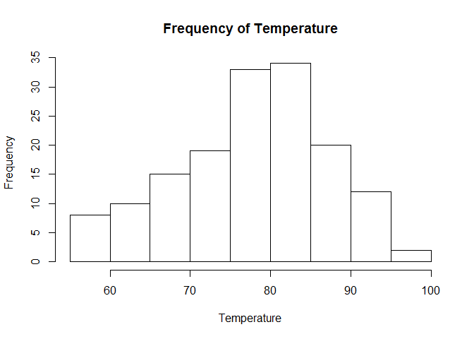 

```r
library(ggplot2)
ggplot(data=airquality, aes(x=Temp)) + geom_histogram() +
  labs(title="Frequency of Temperature", x="Temperature", y="Frequency")
```

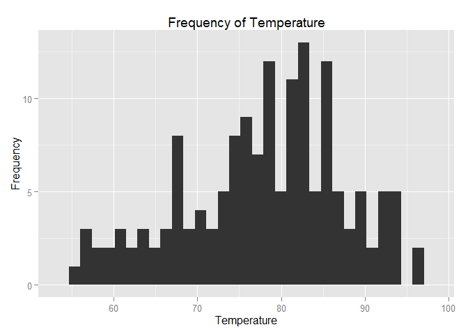 

### How do I plot a histogram with density line?

```r
url = "http://vincentarelbundock.github.io/Rdatasets/csv/datasets/airquality.csv"
download.file(url, "airquality.csv", quiet=TRUE)
air <- read.csv("airquality.csv", header=TRUE, stringsAsFactors=FALSE)
hist(air$Temp, prob=TRUE, main = "Density plot of Temperature", xlab = "Temperature", ylab = "Density")
lines(density(air$Temp),col = "blue")
```

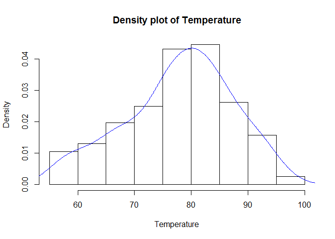 

```r
library(ggplot2)
ggplot(data=air, aes(x=Temp)) + geom_histogram(aes(y=..density..)) +
  geom_density(colour="blue") +
  labs(title="Frequency of Temperature", x="Temperature", y="Frequency")
```

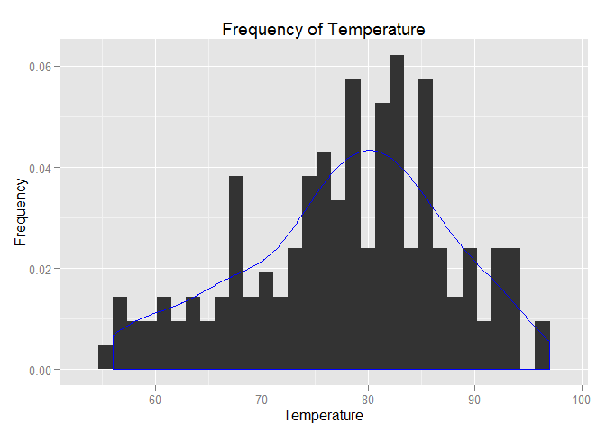 

### How do I make a scatterplot?

```r
url = "http://vincentarelbundock.github.io/Rdatasets/csv/datasets/airquality.csv"
download.file(url, "airquality.csv", quiet=TRUE)
air <- read.csv("airquality.csv", header=TRUE, stringsAsFactors=FALSE)
plot(Wind~Temp,data=air,pch=20, main = "Wind vs Temperature", xlab = "Temperature", ylab = "Wind")
```

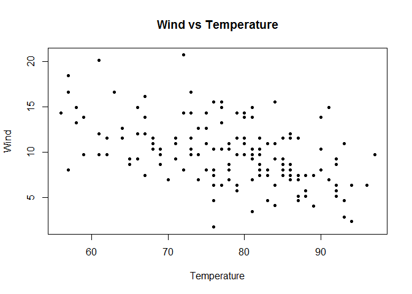 

```r
library(ggplot2)
ggplot(data=air, aes(x=Temp,y=Wind)) + geom_point() +
  labs(title="Wind vs Temperature", x="Temperature", y="Wind")
```

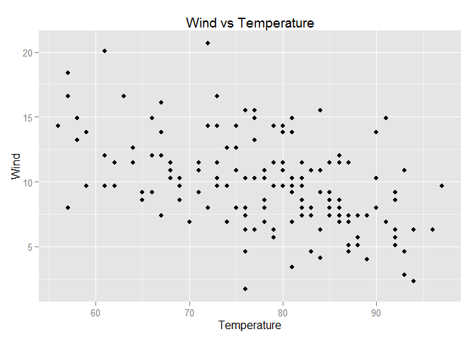 

### How do I make a boxplot (single variable)?

```r
url = "http://vincentarelbundock.github.io/Rdatasets/csv/datasets/airquality.csv"
download.file(url, "airquality.csv", quiet=TRUE)
air <- read.csv("airquality.csv", header=TRUE, stringsAsFactors=FALSE)
boxplot(air$Ozone, main="Ozone", horizontal=TRUE)
```

 

```r
library(ggplot2)
ggplot(data=air, aes(x=factor(0),y=Ozone)) + geom_boxplot() + coord_flip() +
  labs(title="Ozone", x="")
```

```
## Warning in loop_apply(n, do.ply): Removed 37 rows containing non-finite
## values (stat_boxplot).
```

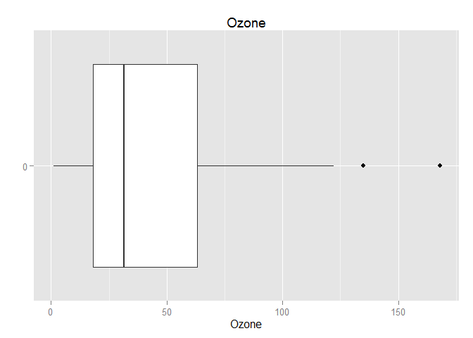 


## Categorical Variables
### How do I make a side-by-side boxplot?

```r
url = "http://vincentarelbundock.github.io/Rdatasets/csv/datasets/iris.csv"
download.file(url, "iris.csv", quiet=TRUE)
iris <- read.csv("iris.csv", header=TRUE, stringsAsFactors=FALSE)
boxplot(Petal.Length~Species,data=iris, main="Petal Length vs Species")
```

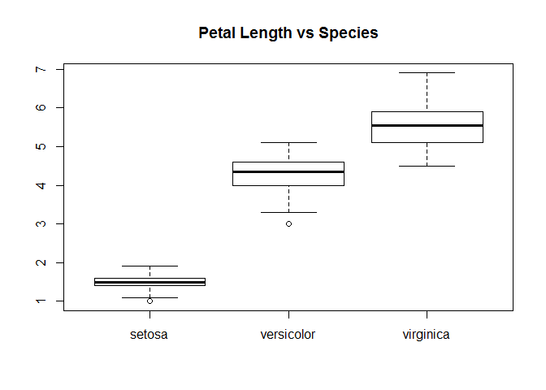 

```r
library(ggplot2)
# Species is a factor
ggplot(data=iris, aes(x=Species, y=Petal.Length)) + geom_boxplot() +
  labs(title="Petal Length vs Species")
```

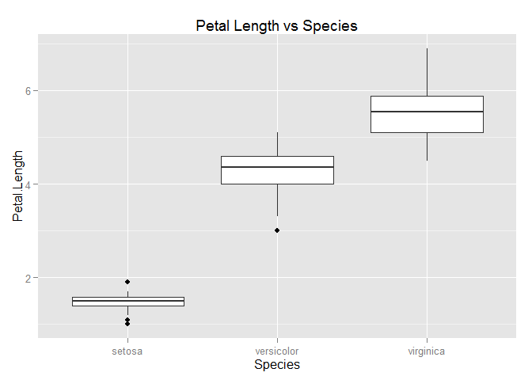 

### How do I make a barplot?

```r
url = "http://vincentarelbundock.github.io/Rdatasets/csv/datasets/mtcars.csv"
download.file(url, "mtcars.csv", quiet=TRUE)
cars <- read.csv("mtcars.csv", header=TRUE, stringsAsFactors=FALSE)
with(cars, barplot(table(cyl),main="Count of Cars vs Cylinder Types",xlab="Cylinder Type", ylab="Count"))
```

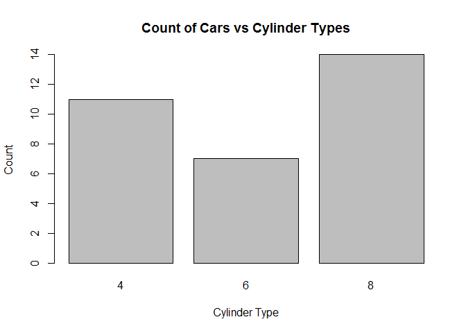 

```r
library(ggplot2)
ggplot(data=cars, aes(x=factor(cyl))) + geom_bar() +
  labs(title="Count of Cars vs Cylinder Types", x="Cylinder Type", y="Count")
```

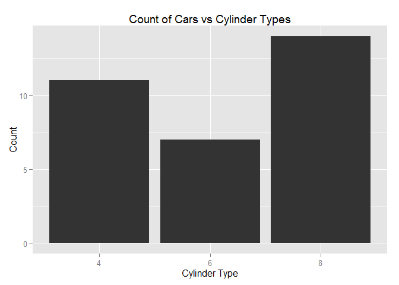 

## Maps
### How do I read and plot Shape (SHP) files?

Here we shall plot the Singapore map outline using data from [Diva GIS](http://www.diva-gis.org/).


```r
library(httr)
url <- "http://biogeo.ucdavis.edu/data/diva/adm/SGP_adm.zip"
GET(url, write_disk("SGP_adm.zip", overwrite=TRUE))
```

```
## Response [http://data.biogeo.ucdavis.edu/data/diva/adm/SGP_adm.zip]
##   Date: 2015-05-21 22:42
##   Status: 200
##   Content-Type: application/zip
##   Size: 64.2 kB
## <ON DISK>  SGP_adm.zip
```

```r
unzip("SGP_adm.zip",exdir="./SGP_adm")
library(rgdal)
ogrListLayers(dsn="./SGP_adm/SGP_adm0.shp")
```

```
## [1] "SGP_adm0"
## attr(,"driver")
## [1] "ESRI Shapefile"
## attr(,"nlayers")
## [1] 1
```

```r
sgp <- readOGR(dsn="./SGP_adm/SGP_adm0.shp", layer="SGP_adm0")
```

```
## OGR data source with driver: ESRI Shapefile 
## Source: "./SGP_adm/SGP_adm0.shp", layer: "SGP_adm0"
## with 1 features
## It has 70 fields
```

```r
plot(sgp)
```

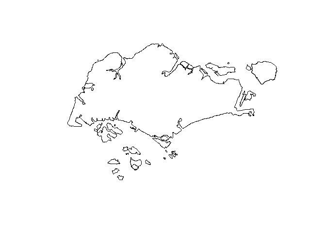 
